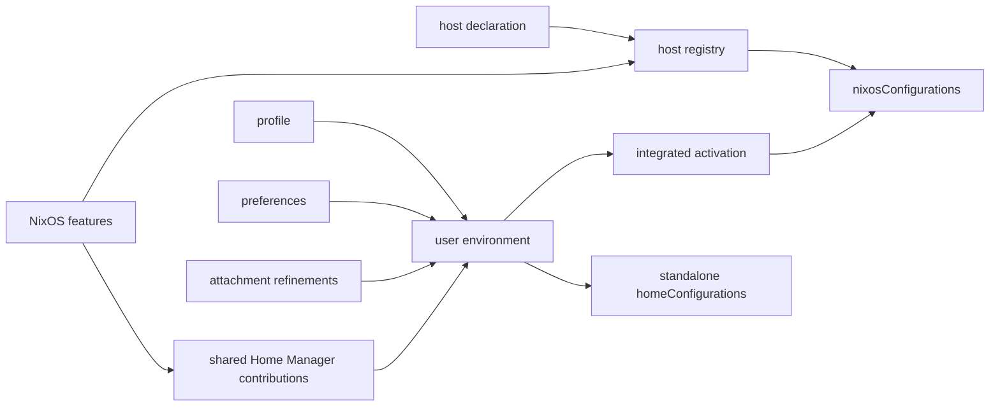

# Hosts and user environments

This flake treats a machine and the user environments attached to it as related,
but separately owned, configuration. A host declaration selects NixOS modules;
each user attachment selects a reusable Home Manager profile, optional personal
preferences, and final host-specific refinements. The host registry assembles
those declarations into flake outputs.

The goal is to make ownership visible. Reusable policy should not be buried in a
host, personal choices should not leak into a shared profile, and a NixOS feature
should not reach into `home-manager.users` directly.



## Layers and module classes

All `.nix` files under `modules/` are discovered by `import-tree` and evaluated
as **flake-parts modules**. Those outer modules may declare registry data or
export modules for another module system:

| Layer | Owns | Typical location |
|---|---|---|
| Flake-parts | Flake inputs, registries, packages, apps, and exported modules | `modules/` |
| NixOS | Machine services, hardware, users, boot, and system policy | `modules/features/`, `modules/de/`, `modules/host/` |
| Home Manager | User programs and session configuration | `modules/programs/`, `modules/profiles/`, `modules/preferences/` |
| Nix-on-Droid | Android-hosted Nix environment and device activation | `modules/nix-on-droid/` |

Keep these module classes separate:

- export NixOS modules as `flake.modules.nixos.<name>`;
- export Home Manager modules as `flake.modules.homeManager.<name>`;
- export Nix-on-Droid modules as `flake.nixOnDroidModules.<name>`; and
- evaluate flake-parts modules only at the outer flake layer.

An exported NixOS module cannot be imported as a Home Manager module merely
because both use the Nix module syntax. Deferred module types can postpone that
mistake until a distant evaluation point, so the export namespace is part of the
contract.

## Host registry

`modules/host-plumbing/registry.nix` declares the `host.<name>` registry. Each
entry describes one NixOS evaluation target and produces:

```text
host.<name>  ->  nixosConfigurations.<name>
```

Capabilities may additionally produce system-indexed helper applications, such
as an ISO writer or a `nixos-anywhere` deployer. Capabilities describe auxiliary
outputs; they do not change how a user's Home Manager configuration is activated.

A representative declaration is:

```nix
{ inputs, ... }:
{
  host.example = {
    description = "Example workstation";
    primaryUser = "alice";
    stateVersion = "24.11";

    modules = with inputs.self.modules.nixos; [
      kde
      ssh-host
    ];

    userEnvironment.alice = {
      mode = "integrated";
      profile = "workstation";
      preferences = "alice";
    };
  };
}
```

The registry supplies common NixOS plumbing before the host's selected modules:

- global system policy;
- the NixOS host-identity implementation; and
- the interface through which NixOS features contribute Home Manager modules.

It also selects the target platform and Nixpkgs input, and uses the declared
state version as the default for NixOS and attached Home Manager environments.

### Host declaration contract

A host declaration owns:

- a human-readable description and primary interactive user;
- compatibility state version;
- target system and Nixpkgs source when the repository defaults are unsuitable;
- the NixOS module graph;
- the Home Manager channel used by its attachments;
- zero or more user-environment attachments; and
- optional helper-output capabilities.

`stateVersion` is compatibility metadata. Set it to the version used when an
installation or user environment was created, and do not advance it as part of
routine Nixpkgs or Home Manager updates.

## Host identity

`modules/host-identity.nix` defines a class-neutral, read-only identity shape:

```nix
hostIdentity = {
  name = "example";
  description = "Example workstation";
  primaryUser = "alice";
  stateVersion = "24.11";
};
```

The registry derives this value from the host declaration. Consumers should use
it instead of repeating host metadata:

```nix
{ config, ... }:
{
  users.users.${config.hostIdentity.primaryUser}.isNormalUser = true;
}
```

Platform implementations add only platform-specific behavior. NixOS derives
`networking.hostName` from the identity. Nix-on-Droid shares the metadata shape
and compatibility version but does not pretend to control Android's kernel
hostname.

## User-environment attachments

An attachment lives at `host.<host>.userEnvironment.<username>`. It records:

- `mode`: integrated with NixOS or activated standalone;
- `profile`: the reusable environment role;
- `preferences`: an optional personal preference collection;
- `homeDirectory`: normally inferred from the username; and
- `modules`: final configuration unique to this user on this host.

Each evaluated Home Manager environment receives read-only context:

```nix
userEnvironment = {
  hostName = "example";
  username = "alice";
  profile = "workstation";
  preferences = "alice"; # or null
};
```

Shared Home Manager modules should use this contract when they need attachment
identity. They must not depend on `osConfig`, because `osConfig` exists only for
integrated activation.

### Composition order and ownership

The effective Home Manager module graph combines:

```text
host feature contributions
+ selected profile
+ selected preferences
+ attachment modules
```

The layers have distinct responsibilities:

| Layer | Responsibility |
|---|---|
| Program | Configure one Home Manager program with reusable, refinable defaults. Importing it enables that program. |
| Feature | Implement a coherent capability, possibly with separate NixOS and Home Manager exports. |
| Profile | Bundle features into a reusable user-environment role. |
| Preferences | Hold identity and choices that should follow a person between hosts. |
| Attachment | Apply the final exception that is specific to one user on one host. |

Import order is not precedence. The Nix module system merges definitions by
priority:

- use `lib.mkDefault` for policy intended to be refined;
- use ordinary definitions for deliberate preferences and host refinements;
- use `lib.mkBefore` and `lib.mkAfter` for meaningful list ordering; and
- reserve `lib.mkForce` for explicit conflict resolution.

Unknown profile or preference names are errors. This is intentional: a typo
must not silently produce a partial environment.

## Feature contributions and host context

A reusable NixOS feature that also affects user sessions exports separate module
classes. Its NixOS half contributes the Home Manager half through
`userEnvironment.sharedModules`:

```nix
{ inputs, ... }:
let
  homeModule = { lib, ... }: {
    programs.example.enable = lib.mkDefault true;
  };
in
{
  flake.modules.homeManager.example = homeModule;

  flake.modules.nixos.example = { ... }: {
    services.example.enable = true;
    userEnvironment.sharedModules = [ homeModule ];
  };
}
```

This keeps the registry responsible for attachment and gives integrated and
standalone environments the same feature contribution. A feature must not set
`home-manager.users` itself.

When the Home Manager half needs a small piece of evaluated host state, define a
narrow typed option under `hostContext.<feature>` and populate it from the NixOS
half. Do not mirror the entire NixOS configuration. The consumer should tolerate
the context being absent so it remains usable outside that feature composition.

## Activation modes

Both modes consume the same profile, preferences, attachment modules, feature
contributions, package set, and selected Home Manager input.
The registry constructs their effective Home Manager module list once and passes
that same composition to either evaluator, so activation mode cannot change the
environment's module graph.

### Integrated

Integrated environments are installed beneath
`home-manager.users.<username>` and activate with the NixOS system. Home Manager
uses the host's package set, including its overlays and Nixpkgs configuration.
The host's NixOS modules remain responsible for defining the corresponding Unix
account and its system-level permissions.

### Standalone

Standalone environments produce:

```text
homeConfigurations."<username>@<host>"
```

They activate independently, but are still attached to a registered NixOS host.
The registry evaluates the associated NixOS configuration to obtain the same
package set and feature contributions. “Standalone” therefore describes the
activation boundary, not an independent machine registry.

Nix-on-Droid configurations are outside this registry. They may reuse Home
Manager profiles, but NixOS feature contributions do not flow into them unless
an explicit Nix-on-Droid composition provides an equivalent contract.

## Extension checklist

When adding or changing a host-facing capability:

1. Decide which module system owns each effect.
2. Export each reusable module in the namespace for its class.
3. Put reusable machine policy in a feature and concrete machine facts in the
   host declaration.
4. Put reusable user policy in programs, features, or profiles; put personal
   choices in preferences.
5. Use attachment modules only for one-user-on-one-host refinements.
6. Contribute Home Manager behavior through `userEnvironment.sharedModules`.
7. Keep shared Home Manager modules portable across activation modes.
8. Evaluate the affected NixOS configuration and, where applicable, both its
   integrated or standalone Home Manager output.

Hosted-service composition has additional ingress contracts documented in
[`serve.md`](serve.md). Secret identities and runtime deployment are documented
in [`secrets.md`](secrets.md).
