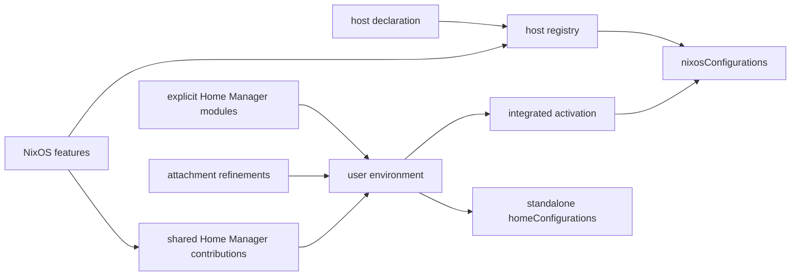

# Hosts and user environments

This flake treats a machine and the user environments attached to it as related,
but separately owned, configuration. A host declaration selects NixOS modules;
each user attachment explicitly composes reusable Home Manager modules and final
host-specific refinements. The host registry assembles those declarations into
flake outputs.

The goal is to make ownership visible. Reusable policy should not be buried in a
host, personal choices should not leak into a shared aspect, and a NixOS feature
should not reach into `home-manager.users` directly.



## Layers and module classes

All `.nix` files under `modules/` are discovered by `nucleus` and evaluated
as **flake-parts modules**. Those outer modules may declare registry data or
export modules for another module system:

| Layer | Owns | Typical location |
|---|---|---|
| Flake-parts | Flake inputs, registries, packages, apps, and exported modules | `modules/` |
| NixOS | Machine services, hardware, users, boot, and system policy | `modules/features/`, `modules/de/`, `modules/host/` |
| Home Manager | User programs and session configuration | `modules/programs/`, `modules/aspects/`, `modules/preferences/` |
| Nix-on-Droid | Android-hosted Nix environment and device activation | `modules/features/`, `modules/host/` |

Keep these module classes separate:

- export NixOS modules as `flake.modules.nixos.<name>`;
- export Home Manager modules as `flake.modules.homeManager.<name>`;
- export Nix-on-Droid modules as `flake.modules.nixOnDroid.<name>`; and
- evaluate flake-parts modules only at the outer flake layer.

An exported NixOS module cannot be imported as a Home Manager module merely
because both use the Nix module syntax. Deferred module types can postpone that
mistake until a distant evaluation point, so the export namespace is part of the
contract.

## Host registry

`modules/host-plumbing/registry.nix` declares the `host.<name>` registry. Each
entry describes one evaluation target, in the module class it declares, and
produces the configuration output of that class:

```text
host.<name>  ->  nixosConfigurations.<name>            # class = "nixos"
host.<name>  ->  nixOnDroidConfigurations.<name>       # class = "nixOnDroid"
```

A host's `class` selects both the configuration builder and the module
namespace its `modules` are drawn from. It defaults to `nixos`, so only a
non-NixOS host declares it.

Capabilities may additionally produce system-indexed helper applications, such
as an ISO writer or a `nixos-anywhere` deployer. Capabilities describe auxiliary
outputs; they do not change how a user's Home Manager configuration is
activated, and they are generated for NixOS hosts only.

A representative declaration is:

```nix
{ inputs, ... }:
{
  host.example = {
    description = "Example workstation";
    primaryUser = "alice";
    stateVersion = "24.11";

    modules = with inputs.self.modules.nixos; [
      kde
      ssh-host
    ];

    userEnvironment.alice = {
      mode = "integrated";
      modules = [
        inputs.self.modules.homeManager.workstation
        inputs.self.modules.homeManager.alice
      ];
    };
  };
}
```

The registry supplies common plumbing before the host's selected modules:

- global system policy, for NixOS hosts;
- the host-identity implementation of the host's class; and
- the interface through which platform features contribute Home Manager modules.

It also selects the target platform and Nixpkgs input, and uses the declared
state version as the default for the host system and its attached Home Manager
environments.

### Host declaration contract

A host declaration owns:

- a human-readable description and primary interactive user;
- compatibility state version;
- the module class it is evaluated in, when it is not NixOS;
- target system and Nixpkgs source when the repository defaults are unsuitable;
- the module graph of its class;
- the Home Manager channel used by its attachments, or the Home Manager flake
  itself when the host's platform requires a release outside those channels;
- zero or more user-environment attachments; and
- optional helper-output capabilities.

The declaration is also the assembly point for private host implementation
fragments. Put conventional NixOS and Home Manager fragments under
`hosts/<hostname>/`, group them by ownership, and import them only from that
host's declaration. They are private configuration, not exports in
`flake.modules.*`. Keep identity, reusable module and aspect selection, helper
capabilities, and the private-fragment composition visible in the declaration.
Each host tree exposes a conventional `default.nix` entrypoint that assembles
its fragments into lists keyed by module class. The entrypoint is a function of
one attribute set; the flake-parts host declaration calls it through
`config.flake.lib.importHostFragments "<hostname>"` rather than reaching into
the tree with location-dependent relative paths.

```nix
# hosts/example/default.nix
{ fleet, inputs, ... }:
{
  nixos = [ ./hardware.nix (import ./system.nix { inherit inputs; }) ];
  homeManager = [ ./home/user.nix ];
}
```

Every entrypoint receives the same arguments and ignores the ones it does not
need. Shared facts are handed to the tree instead of being read out of
`config.flake`, so a fragment that starts depending on fleet state does not
change how its host declares it.

Never put a conventional fragment under `modules/`: nucleus evaluates every
discovered `.nix` file there as a flake-parts module. If policy in private host
trees is repeated with the same semantics and lifecycle, promote it to the
narrowest reusable typed module instead of sharing a private fragment.

`stateVersion` is required compatibility metadata. Set it to the version used
when an installation or user environment was created, and do not advance it as
part of routine Nixpkgs or Home Manager updates. A genuinely fresh
reinstallation may intentionally choose a new baseline; an in-place update
almost never should.

## Host identity

`modules/host-identity.nix` defines a class-neutral, read-only identity shape:

```nix
hostIdentity = {
  name = "example";
  description = "Example workstation";
  primaryUser = "alice";
  stateVersion = "24.11";
};
```

The registry derives this value from the host declaration. Consumers should use
it instead of repeating host metadata:

```nix
{ config, ... }:
{
  users.users.${config.hostIdentity.primaryUser}.isNormalUser = true;
}
```

Platform implementations add only platform-specific behavior. NixOS derives
`networking.hostName` from the identity. Nix-on-Droid shares the metadata shape
and compatibility version but does not pretend to control Android's kernel
hostname.

## User-environment attachments

An attachment lives at `host.<host>.userEnvironment.<username>`. It records:

- `mode`: integrated with NixOS or activated standalone;
- `homeDirectory`: normally inferred from the username; and
- `modules`: the complete explicit composition of reusable and host-specific
  Home Manager modules.

The registry sets `hasGui` when the NixOS host enables a display manager, so
shared modules can select graphical behavior without relying on integrated-only
`osConfig`.

Each evaluated Home Manager environment receives context:

```nix
userEnvironment = {
  hostName = "example";
  username = "alice";
};
```

Shared Home Manager modules should use this contract when they need attachment
identity. They must not depend on `osConfig`, because `osConfig` exists only for
integrated activation.

### Composition order and ownership

The effective Home Manager module graph combines:

```text
host feature contributions
+ explicitly attached modules
```

The layers have distinct responsibilities:

| Layer | Responsibility |
|---|---|
| Program | Configure one Home Manager program with reusable, refinable defaults. Importing it enables that program. |
| Feature | Implement a coherent capability, possibly with separate NixOS and Home Manager exports. |
| Aspect | Bundle features into a reusable, composable user-environment role. |
| Preferences | Hold identity and choices that should follow a person between hosts. |
| Attachment | Apply the final exception that is specific to one user on one host. |

Import order is not precedence. The Nix module system merges definitions by
priority:

- use `lib.mkDefault` for policy intended to be refined;
- use ordinary definitions for deliberate preferences and host refinements;
- use `lib.mkBefore` and `lib.mkAfter` for meaningful list ordering; and
- reserve `lib.mkForce` for explicit conflict resolution.

Aspects and preferences are ordinary exported Home Manager modules rather than
separate registry types. A host attachment composes them explicitly through
`modules`, just like any other reusable Home Manager module. See
[Module ownership](modules.md) for the repository-wide ownership model,
including fleet state and the policy-promotion rule.

## Feature contributions and host context

A reusable NixOS feature that also affects user sessions exports separate module
classes. Its NixOS half contributes the Home Manager half through
`userEnvironment.sharedModules`:

```nix
{ inputs, ... }:
let
  homeModule = { lib, ... }: {
    programs.example.enable = lib.mkDefault true;
  };
in
{
  flake.modules.homeManager.example = homeModule;

  flake.modules.nixos.example = { ... }: {
    services.example.enable = true;
    userEnvironment.sharedModules = [ homeModule ];
  };
}
```

This keeps the registry responsible for attachment and gives integrated and
standalone environments the same feature contribution. A feature must not set
`home-manager.users` itself.

Feature contributions apply to every Home Manager environment explicitly
attached under `host.<name>.userEnvironment`; they do not apply to other NixOS
users or service accounts. Consequently, attaching a service account also opts
it into every host-wide contribution. Keep this invariant in mind before adding
managed users with roles that differ from the host's primary user.

When the Home Manager half needs a small piece of evaluated host state, define a
narrow typed option under `hostContext.<feature>` and populate it from the NixOS
half. Do not mirror the entire NixOS configuration. The consumer should tolerate
the context being absent so it remains usable outside that feature composition.

## Activation modes

Both modes consume the same explicitly attached modules, feature contributions,
package set, and selected Home Manager input.
The registry constructs their effective Home Manager module list once and passes
that same composition to either evaluator, so activation mode cannot change the
environment's module graph.

### Integrated

Integrated environments are installed beneath
`home-manager.users.<username>` and activate with the NixOS system. Home Manager
uses the host's package set, including its overlays and Nixpkgs configuration.
The host's NixOS modules remain responsible for defining the corresponding Unix
account and its system-level permissions.

### Standalone

Standalone environments produce:

```text
homeConfigurations."<username>@<host>"
```

They activate independently, but are still attached to a registered NixOS host.
Only NixOS hosts accept standalone attachments.
The registry evaluates the associated NixOS configuration to obtain the same
package set and feature contributions. “Standalone” therefore describes the
activation boundary, not an independent machine registry.

When a host has at least one standalone attachment, its NixOS configuration
installs the Home Manager CLI from the same selected Home Manager input. This
ensures the CLI needed for initial activation is available after deploying the
host, without requiring host-specific package declarations. Choosing which
flake reference to activate remains an operator concern.

### Nix-on-Droid

A `nixOnDroid` host declares its environment the same way, in `integrated`
mode, and receives the same assembled module graph: attachment identity, state
version, explicitly attached modules, and the contributions its Nix-on-Droid
features make through `userEnvironment.sharedModules`.

Android exposes a single account whose name and home directory are platform
facts, so such a host attaches exactly one environment. The registry mirrors
those facts rather than owning them; a divergence surfaces as a definition
conflict instead of a silently wrong home directory.

Because the platform pins its own Nixpkgs and Home Manager releases, a
Nix-on-Droid host normally declares `nixpkgs`, `homeManager.flake`, and, when
the device is too slow to realize its own bootstrap,
`nixOnDroid.bootstrapSystem`.

## Extension checklist

When adding or changing a host-facing capability:

1. Decide which module system owns each effect.
2. Export each reusable module in the namespace for its class.
3. Put reusable machine policy in a feature and concrete machine facts in the
   host declaration.
4. Put reusable user policy in programs, features, or aspects; put personal
   choices in preferences.
5. Use attachment modules only for one-user-on-one-host refinements.
6. Contribute Home Manager behavior through `userEnvironment.sharedModules`.
7. Keep shared Home Manager modules portable across activation modes.
8. Evaluate the affected NixOS configuration and, where applicable, both its
   integrated or standalone Home Manager output.

Hosted-service composition has additional ingress contracts documented in
[`serve.md`](serve.md). Secret identities and runtime deployment are documented
in [`secrets.md`](secrets.md).
