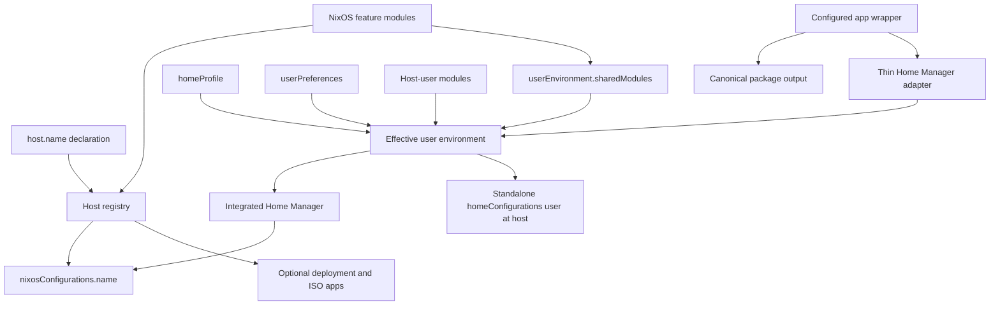
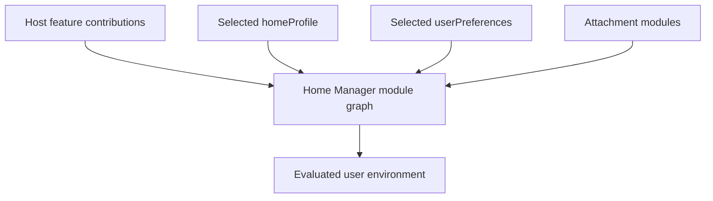

# Hosts and user environments

This flake uses a declarative host registry to build NixOS systems and to attach
Home Manager user environments to those systems. Host features, reusable
profiles, personal preferences, and host-specific overrides remain separate, but
are composed into one Home Manager configuration for each managed user.

The host registry described here manages NixOS hosts. A standalone Home Manager
environment is still associated with a registered NixOS host; “standalone” only
means that it is activated separately from `nixos-rebuild`.

Nix-on-Droid devices are separate from the NixOS host registry. Reusable
Nix-on-Droid modules are exported under `nixOnDroidModules`, and complete device
configurations are exported under `nixOnDroidConfigurations`. Their embedded
Home Manager configurations may consume the same `homeProfile` collections,
but do not receive NixOS feature contributions. A nix-on-droid device receives
the same `hostIdentity` metadata shape as a NixOS host, although its name is not
wired to Android's kernel hostname.

## Architecture at a glance

Files under `modules/` are loaded by `import-tree` as flake-parts modules. They
usually do one or more of the following:

- Export reusable modules under `flake.modules.nixos` or
  `flake.modules.homeManager`.
- Register a host under `host.<name>`.
- Declare a reusable `homeProfile` or `userPreferences` collection.
- Define configured application artifacts under `modules/app-config/` as
  reusable wrappers and packages.
- Extend the host registry or provide shared flake infrastructure.

The registry in `modules/host-plumbing/registry.nix` converts those declarations
into flake outputs.



## Registering a host

Hosts are declared under `host.<name>`, normally in `modules/host/`:

```nix
{ inputs, ... }:
{
  host.example = {
    description = "Example workstation";
    primaryUser = "alice";
    stateVersion = "26.05";

    modules = with inputs.self.modules.nixos; [
      kde
      ssh-host
    ];
  };
}
```

This produces:

```text
nixosConfigurations.example
```

The registry automatically prepends the following modules to every host:

- `global-config`
- `host-identity`
- the `userEnvironment.sharedModules` contribution interface

It also sets `nixpkgs.hostPlatform` and `system.stateVersion` from the host
registry values before adding the host's own modules.

### Host options

| Option | Default | Purpose |
|---|---|---|
| `system` | `"x86_64-linux"` | Nix system used to evaluate the host. |
| `nixpkgs` | `inputs.unstable-nixpkgs` | Nixpkgs flake used for the NixOS configuration. |
| `description` | Required | Human-readable host description. |
| `primaryUser` | Required | Primary interactive user. |
| `stateVersion` | `"26.05"` | Default for NixOS and Home Manager state versions. |
| `modules` | `[ ]` | NixOS modules composing the host. |
| `homeManager.channel` | `"unstable"` | Selects the stable or unstable Home Manager input. |
| `userEnvironment` | `{ }` | User environments attached to the host. |
| `capabilities` | All disabled | Enables generated helper applications. |

Although `stateVersion` has a default, it should normally be written explicitly
for persistent machines. It describes the compatibility behavior expected by an
existing installation; it is not a package release preference and should not be
advanced automatically when updating Nixpkgs.

## Host identity

The class-neutral host identity contract defines a read-only `hostIdentity` set:

```nix
hostIdentity = {
  name = "example";
  description = "Example workstation";
  primaryUser = "alice";
  stateVersion = "26.05";
};
```

Platform implementations add their own behavior around this shared metadata.
The NixOS implementation wires `hostIdentity.name` to `networking.hostName`.
The nix-on-droid implementation derives `system.stateVersion` from
`hostIdentity.stateVersion`, but does not attempt to change Android's kernel
hostname.

The NixOS registry derives the identity from each host declaration.

Host modules can use this metadata rather than repeating literal values:

```nix
{ config, ... }:
{
  users.users.${config.hostIdentity.primaryUser}.isNormalUser = true;
}
```

The registry sets the NixOS compatibility version as though the host contained:

```nix
system.stateVersion = lib.mkDefault host.stateVersion;
```

A host module can deliberately override that default, but changing a state
version requires the same care as changing `system.stateVersion` in an ordinary
NixOS configuration.

## User environments

A user environment is attached beneath its host and keyed by the Unix username:

```nix
host.example.userEnvironment.alice = {
  mode = "integrated";
  profile = "workstation";
};
```

The username determines the default home directory:

- `root` defaults to `/root`.
- Other users default to `/home/<username>`.

It can be overridden when necessary:

```nix
host.example.userEnvironment.alice.homeDirectory = "/srv/home/alice";
```

### User environment options

| Option | Default | Purpose |
|---|---|---|
| `mode` | Required | `"integrated"` or `"standalone"`. |
| `profile` | Required | Name of a registered `homeProfile`. |
| `preferences` | `null` | Optional name from `userPreferences`. |
| `homeDirectory` | Inferred | Home directory for this host and user. |
| `modules` | `[ ]` | Modules specific to this user on this host. |

Home Manager's `home.stateVersion` is set with `lib.mkDefault` from the host's
`stateVersion`. A profile, preference module, or attachment module may override
it, although sharing the host value is the intended normal case.

Each evaluated Home Manager configuration also receives read-only identity
metadata:

```nix
userEnvironment = {
  hostName = "example";
  username = "alice";
  profile = "workstation";
  preferences = "alice"; # or null
};
```

This provides host context in both activation modes without requiring a shared
module to depend on integrated-only arguments such as `osConfig`.

## Profiles and preferences

Profiles describe reusable environment roles. Preferences describe a person's
choices. Both are collections of Home Manager modules, but the distinction helps
keep configuration ownership clear.

### Profile example

```nix
{
  homeProfile.workstation.modules = [
    {
      programs.home-manager.enable = true;
      programs.git.enable = true;
      programs.neovim.enable = true;
    }
  ];
}
```

A profile might represent a workstation, development environment, server shell,
or other reusable baseline.

### Preferences example

```nix
{
  userPreferences.alice.modules = [
    {
      programs.git = {
        userName = "Alice Example";
        userEmail = "alice@example.invalid";
      };

      programs.neovim.defaultEditor = true;
    }
  ];
}
```

Attach both to a user:

```nix
host.example.userEnvironment.alice = {
  mode = "integrated";
  profile = "workstation";
  preferences = "alice";
};
```

### Program modules and feature compositions

Opinionated Home Manager program modules are exported under
`flake.modules.homeManager` for Ghostty, Nushell, SSH, GPG, Git, MPV, and Zed.
MPV is a thin adapter: it instantiates the reusable configured wrapper against
the Home Manager evaluation's own `pkgs`, installs it, and owns only its MIME
associations. The immutable MPV configuration itself belongs to the app-config
artifact layer.
Importing one enables that program with defaults that can be refined by a
profile, preferences, or a host/user attachment.

Feature modules compose those program modules:

| Feature | Composition |
|---|---|
| `standard-terminal` | Ghostty, Nushell, and the standard interactive terminal tools. |
| `ssh-client` | SSH client defaults, identity selection, and related shell helpers. |
| `pgp` | GPG, agent configuration, and optional Git signing. |
| `ai-coding` | Zed with LM Studio, Codex, and AI-oriented editor settings. |
| `coding` | PGP, Git, and AI coding. |

The `workstation` profile currently imports `standard-terminal`, `ssh-client`,
`coding`, and the configured MPV adapter. Each constituent remains directly importable, so another profile
or a host/user attachment can select a smaller set:

```nix
host.example.userEnvironment.alice.modules = [
  inputs.self.modules.homeManager.ghostty
  inputs.self.modules.homeManager.git
];
```

The `alaestor` preference collection supplies personal Git identity, PGP
fingerprint, and SSH identity values without placing them in reusable program
policy.

### Host-user refinements

The attachment's `modules` field is for configuration that only applies to one
user on one host:

```nix
host.example.userEnvironment.alice.modules = [
  {
    programs.plasma.workspace.wallpaper = ./example-wallpaper.png;
  }
];
```

Do not use attachment modules for preferences that should follow the user to
other hosts; put those in `userPreferences` instead.

## How modules are composed

For each attachment, the registry builds the effective Home Manager module graph
from four sources:



Conceptually, the module list is:

```nix
hostFeatureModules
++ profile.modules
++ preferences.modules
++ attachment.modules
```

This ordering does **not** mean that later modules automatically win. Nix modules
merge definitions by priority rather than import order:

- Feature modules should generally use `lib.mkDefault` for configurable policy.
- Profiles can use defaults for settings intended to be personalized.
- Preferences and attachment modules normally use ordinary definitions.
- `lib.mkForce` should be reserved for intentional conflict resolution.
- List ordering should use `lib.mkBefore` and `lib.mkAfter` where appropriate.

Unknown profile or preference names produce an evaluation error identifying the
missing collection.

## Feature-contributed Home Manager modules

A NixOS feature can provide related user-session configuration without directly
configuring `home-manager.users`. It appends a deferred module to:

```nix
userEnvironment.sharedModules
```

A minimal feature with NixOS and Home Manager halves looks like this:

```nix
{ inputs, ... }:
let
  homeModule =
    { lib, ... }:
    {
      imports = [ inputs.some-project.homeModules.default ];
      programs.some-program.enable = lib.mkDefault true;
    };
in
{
  flake.modules.homeManager.some-feature = homeModule;

  flake.modules.nixos.some-feature =
    { lib, ... }:
    {
      services.some-service.enable = true;

      userEnvironment.sharedModules = [ homeModule ];
    };
}
```

This has three useful properties:

1. Hosts that do not import `some-feature` do not receive its Home Manager module.
2. Hosts without a user environment collect no active Home Manager configuration.
3. Integrated and standalone environments receive the same feature module.

The deferred module must be a Home Manager module or a module that is neutral
between module classes. A NixOS module cannot be placed in
`userEnvironment.sharedModules`.

### KDE and Plasma Manager

`modules/de/kde.nix` uses this pattern. It exports both:

```text
flake.modules.nixos.kde
flake.modules.homeManager.kde
```

Importing the NixOS KDE module contributes the Home Manager KDE module, which in
turn imports Plasma Manager. Plasma Manager is enabled with `lib.mkDefault`, so a
profile or preference can refine its settings.

The contribution can be disabled for a particular host:

```nix
{
  kde.plasmaManager.enable = false;
}
```

That disables the Home Manager contribution without disabling the NixOS Plasma
desktop.

## Integrated activation

Integrated mode imports the selected Home Manager NixOS module and places the
effective configuration under `home-manager.users.<username>`:

```nix
host.example.userEnvironment.alice = {
  mode = "integrated";
  profile = "workstation";
  preferences = "alice";
};
```

The environment is activated with the host:

```sh
sudo nixos-rebuild switch --flake .#example
```

The integration uses:

```nix
home-manager = {
  useGlobalPkgs = true;
  useUserPackages = true;
};
```

Consequently, the user environment uses the same package set as its NixOS host,
including host overlays and Nixpkgs configuration.

The corresponding NixOS user should be defined by the host's NixOS modules:

```nix
{ config, ... }:
let
  username = config.hostIdentity.primaryUser;
in
{
  users.users.${username} = {
    isNormalUser = true;
    extraGroups = [ "wheel" ];
  };
}
```

## Standalone activation

Standalone mode uses the same host, feature contributions, profile, preferences,
and attachment modules, but generates a separate flake output:

```nix
host.example.userEnvironment.alice = {
  mode = "standalone";
  profile = "workstation";
  preferences = "alice";
};
```

The output name is:

```text
homeConfigurations."alice@example"
```

It can be activated separately:

```sh
home-manager switch --flake '.#alice@example'
```

The NixOS configuration remains available as `nixosConfigurations.example`; only
Home Manager activation is separated from `nixos-rebuild`.

Standalone evaluation derives its package set and feature contributions from the
associated NixOS configuration. This keeps it consistent with the host and avoids
a second, independent target registry.

## Selecting a Home Manager channel

The default channel is unstable:

```nix
host.example.homeManager.channel = "unstable";
```

A host using the stable Home Manager input can select:

```nix
host.example.homeManager.channel = "stable";
```

The selected input is used for both activation modes. It should remain compatible
with the host's selected `nixpkgs` input.

## Host capabilities and generated applications

Capabilities are independent of user environments. They generate helper apps for
a host:

```nix
host.example.capabilities = {
  isoWriter = true;
  nixosAnywhere = true;
};
```

Depending on the enabled capability, the registry produces names such as:

```text
apps.<system>.mkbootable-example
apps.<system>.deploy-example
```

For example:

```sh
nix run .#deploy-example -- root@192.168.0.5
```

When initrd SSH is enabled, the deployer maintains an encrypted, stable initrd
host key under `secrets/hosts/<host>/initrd-hostkey.age`. On first deployment it
encrypts the generated key to the public recipients in `data/recipients.txt`.
Later deployments decrypt that file with `secrets/age_sk.txt`; a hardware-backed
identity stub requires its corresponding YubiKey and `age-plugin-yubikey` is
included in the deployer's runtime dependencies. Public recipients can encrypt
new material, but cannot decrypt existing material.

A capability controls an auxiliary flake output. An environment `mode`, by
contrast, controls how user configuration is activated; it is deliberately not
modeled as a capability flag.

## Complete minimal example

The following module declares one profile, one preference collection, and one
integrated host environment:

```nix
{ inputs, ... }:
{
  homeProfile.workstation.modules = [
    {
      programs.home-manager.enable = true;
      programs.git.enable = true;
    }
  ];

  userPreferences.alice.modules = [
    {
      programs.git = {
        userName = "Alice Example";
        userEmail = "alice@example.invalid";
      };
    }
  ];

  host.example = {
    description = "Example workstation";
    primaryUser = "alice";
    stateVersion = "26.05";

    userEnvironment.alice = {
      mode = "integrated";
      profile = "workstation";
      preferences = "alice";
    };

    modules = (with inputs.self.modules.nixos; [
      kde
      ssh-host
    ]) ++ [
      {
        users.users.alice = {
          isNormalUser = true;
          extraGroups = [ "wheel" ];
        };
      }
    ];
  };
}
```

Changing only:

```nix
mode = "standalone";
```

moves activation to `homeConfigurations."alice@example"` while preserving the
same effective environment.

## Relevant files

| File | Responsibility |
|---|---|
| `modules/host-plumbing/registry.nix` | Host schema, environment assembly, and output generation. |
| `modules/host-identity.nix` | Shared identity contract with platform-specific implementations. |
| `modules/host-plumbing/global-config.nix` | NixOS configuration automatically imported by every host. |
| `modules/inputs/home-manager.nix` | Home Manager inputs, flake integration, and initial profiles. |
| `modules/de/kde.nix` | Example of a feature contributing a Home Manager module. |
| `modules/host/*.nix` | Concrete host declarations. |

## Server and domain modules

Server applications live under `modules/serve/services/`, separately from
interactive host features. These modules configure local daemons or artifacts
and expose reusable options under `serve.<service>`. They do not own public
hostnames, TLS policy, reverse-proxy routes, or public firewall exposure.

Public ingress compositions live under `modules/serve/domains/`. A domain module
imports the services it exposes and owns their Caddy virtual hosts,
authentication, TLS behavior, and public ports. Lanser imports `domain-0x04cc`
for its static site, Matrix, and Cinny, and `domain-remotehost` for Filebrowser
and Jellyfin.

Private services that do not belong to a public domain are imported directly by
the host. Lanser therefore imports `serve-torrenting` separately; its
qBittorrent ports remain confined to its VPN namespace and private network
policy.

Static service configuration belongs under `data/serve/` and is accessed
through `self.data`, as with Cinny's homeserver policy. Concrete addresses,
mount points, hardware, and host-specific refinements remain in
`modules/host/lanser.nix`. General machine policy such as `server-hardening`
remains a regular host feature.

The Jellyfin service also installs `jellybuilder`, which projects the NAS media
tree into a Jellyfin-friendly alias library. Its source defaults to
`${config.nas.vault.mountpoint}/Media` when the NAS module is present, and its
destination defaults to `/var/lib/jellyfin/jellymedia`; both are configurable
under `serve.jellyfin.libraryBuilder`. Run `jellybuilder --help` for category,
overwrite, and path overrides. The implementation lives under
`data/serve/jellyfin/`, while flake check `jellybuilder` exercises the filesystem
contract and compatibility with existing `Shows/**/jellylink.py` rules.

## Design guidelines

When extending this system:

- Put machine configuration in NixOS feature or host modules.
- Put reusable user-environment roles in `homeProfile`.
- Put choices that should follow a person in `userPreferences`.
- Put one-host exceptions in an attachment's `modules`.
- Let NixOS features contribute Home Manager modules through
  `userEnvironment.sharedModules` rather than configuring users directly.
- Keep contributed modules portable between integrated and standalone Home
  Manager; avoid requiring `osConfig` unless the module is explicitly
  integration-only.
- Treat `stateVersion` as compatibility metadata, not an update channel.
