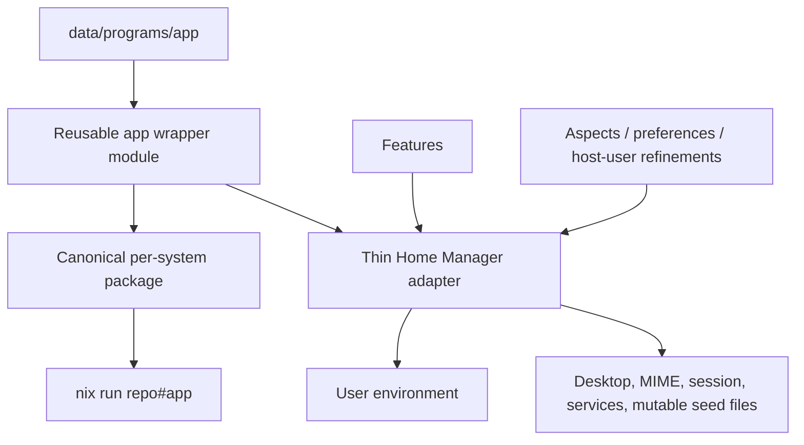

# Research: package-coupled application configuration

> [!NOTE]
> This is a design record for the implemented MPV prototype, not operational
> documentation. Current behavior is defined by `modules/app-config/mpv.nix`
> and its Home Manager adapter in `modules/programs/mpv.nix`.

Research date: 2026-07-22

## Implemented MPV prototype

The first prototype is now implemented under `modules/app-config/mpv.nix`.
It exports reusable `wrappers.mpv` and `wrapperModules.mpv` entries plus the
canonical `packages.x86_64-linux.mpv` artifact. A second
`packages.x86_64-linux.mpv-software` artifact extends the canonical module with
software decoding and conservative OpenGL settings, has the distinct
`mpv-software` executable, and omits desktop entries to avoid MIME collisions.

Both packages use the wrapper library's complete `configDir` mode. Their
`mpv.conf`, `input.conf`, ModernX options, and scripts live in the immutable
store-backed configuration directory, so MPV ignores `~/.config/mpv`. Mutable
cache/state and the configured screenshot directory retain MPV's normal user
locations. Wrapper options precede caller arguments, so explicit command-line
options can still override the packaged policy.

`modules/programs/mpv.nix` is deliberately thin. It constructs the canonical
wrapper with the Home Manager evaluation's own `pkgs`, installs it, and retains
the legacy `mpv.desktop` MIME defaults. The workstation aspect selects this
adapter; Home Manager's `programs.mpv` and ambient MPV configuration files are
not used.

## Conclusion

Configured wrapper packages are a good fit for part of this flake, but not as a
replacement for Home Manager.

The useful architectural split is:

| Concern | Recommended owner |
|---|---|
| Immutable configuration needed whenever one executable starts | Configured package/wrapper |
| A portable `nix run repo#app` artifact | Configured package/wrapper |
| Package selection, desktop/MIME integration, session variables, shell registration, and user services | Home Manager or NixOS |
| Cross-program policy and host/user refinement | Features, aspects, preferences, and attachment modules |
| Mutable application state | The application in XDG state/data/cache paths |
| Credentials, private keys, and tokens | Secret/runtime facilities, never a wrapper or ordinary flake data |

Make wrappers a new reusable artifact layer underneath the existing Home
Manager composition model, and keep thin Home Manager adapters for ambient
integration. Do not turn every current `programs.*` module into a wrapper, and do
not make a global overlay replace ordinary Nixpkgs packages with personal ones.

The best first experiment is mpv. Its configuration, bindings, scripts, script
options, shaders, and customized base package form a coherent launch-time unit,
and mpv has first-class flags for loading them. The legacy
`__legacy/user env/mpv.nix` is almost a catalogue of the things a wrapper can
bundle. MIME associations should remain in a small Home Manager adapter.

Nushell is a reasonable second experiment. Git is worth trying only after the
package/config boundary is established. GPG, WebCord, and the stateful parts of
LibreWolf and Zed should remain Home Manager-managed.

## What the wrapper approach actually changes

Home Manager already couples a package and its files in the resulting home
generation. The remaining looseness is the *distribution boundary*: a user must
activate a Home Manager configuration before the program sees the configuration.
Exporting the v2 program modules makes them reusable by other Home Manager users,
but does not make one configured application an independently consumable unit.

A wrapper changes that unit to a derivation:

```text
upstream package + store-backed config + launch flags/environment
                              |
                              v
                    configured package
```

That derivation can be installed by NixOS, Home Manager, `nix profile`, a dev
shell, or another flake. It can also be exposed under `packages.<system>.<name>`.
`nix run` accepts package outputs and chooses the executable using
`meta.mainProgram`, then `pname`, then `name`, so a separate `apps` output is not
normally required ([Nix `run` reference][nix-run]).

This produces several real benefits:

- `nix run repo#mpv` runs the flake's mpv with its immutable configuration
  without touching the caller's dotfiles.
- The package and its required scripts/tools become one versioned closure.
- Multiple named variants can coexist, such as `mpv`, `mpv-software`, or
  `nu-minimal`, without competing for one dotfile path.
- The same artifact can be used in a home profile, a dev shell, or temporarily
  on another Nix machine.
- Removing the package requires no activation-time cleanup of its immutable
  configuration.

It is important not to overstate the result. A wrapper is not a sandbox. A
program launched by `nix run` still inherits the caller's home directory,
environment, sockets, network access, and usually its ordinary XDG data, state,
and cache locations. Unless the application provides sufficiently precise
configuration flags, it may still read user configuration as well. Runtime state
does not become reproducible just because the launch configuration is in the Nix
store.

## Where wrappers work well

A strong wrapper candidate has most of these properties:

1. It accepts an explicit config file/directory flag or a narrowly scoped
   environment variable.
2. Its declarative settings are read-only inputs, separate from mutable state.
3. The flag applies to every relevant entry point, or there is only one entry
   point.
4. Store paths are valid in its configuration language.
5. Its settings do not contain secrets.
6. It does not depend on activation, a long-lived user service, or ownership and
   permission changes in `$HOME`.
7. Its desktop files and auxiliary binaries still point to the wrapped entry
   point.

mpv is a particularly clean example. Upstream supports `--config-dir`,
`--include`, `--input-conf`, explicit scripts, and script options. Its manual
also distinguishes config from cache and state paths ([mpv manual][mpv-manual]).
This permits either of two policies:

- **Layered policy.** Load normal system/user config and then `--include` the
  store-backed configuration. This is friendlier for local experimentation.
- **Hermetic config policy.** Use a store-backed `--config-dir`, ignoring other
  config directories while leaving cache/state discovery intact. This is more
  reproducible but makes local config overrides deliberately harder.

That choice should be explicit per application; wrappers should not silently
change configuration precedence.

Ghostty is also structurally wrapper-friendly. Every configuration key is a CLI
flag, it supports `config-file`, and its CLI-only `config-default-files=false`
can suppress the default user file ([Ghostty configuration][ghostty-config],
[Ghostty `config-file` reference][ghostty-config-file]). A custom Ghostty wrapper
would nevertheless need testing from a desktop launcher, not just a terminal.

Nushell accepts `--config` and `--env-config`, and documents precisely which
startup stages those flags affect ([Nushell configuration][nushell-config]). It
is therefore a good artifact candidate, with two caveats: making it a login shell
and integrating tools such as Starship, Carapace, Atuin, and Zoxide remain
environment-level concerns; and `config nu` must not misleadingly attempt to edit
a read-only store file.

## Where wrappers become awkward

### Mutable files and application-owned databases

The current WebCord module intentionally copies a declarative seed to a writable
`config.json` because WebCord updates it. A store-backed file cannot replace that
workflow. Wrapping with a whole alternate XDG directory would mix immutable
configuration with mutable Electron state and would be a much larger behavioral
change. Keep it in Home Manager.

LibreWolf has an especially important split:

- Enterprise policies are naturally package-level. Firefox supports a
  `distribution/policies.json` inside the installation, or a system policy path
  ([Mozilla policy templates][firefox-policies]).
- Profiles, bookmarks, search engines, containers, extension installation
  state, browsing data, and UI state are user data. The current Home Manager
  module has valuable typed support for these and should remain the owner.

It may eventually be worthwhile to put only the stable policy subset into a
configured LibreWolf package, but a browser wrapper is not a substitute for the
profile module.

Zed reads user settings from `~/.config/zed/settings.json`, while extensions and
their work data live in XDG data paths ([Zed FAQ][zed-faq], [Zed extension
locations][zed-extensions]). `--user-data-dir` moves databases, extensions, and
logs rather than providing a clean settings-file override
([Zed CLI][zed-cli]). Redirecting broad XDG variables to a store path is likely
to break writes or misdirect child processes. Continue using Home Manager unless
Zed gains a supported settings-file flag or a packaging hook for immutable
defaults.

### Services, sockets, identity, and secrets

GPG is a poor all-in-one wrapper candidate. The current module manages the GPG
client, `gpg-agent`, scdaemon, pinentry, shell integration, `GPG_TTY`, and the SSH
agent socket. GnuPG's agent is a long-lived daemon with sockets and a writable
home/key database; its own documentation calls out shell setup for `GPG_TTY` and
`SSH_AUTH_SOCK` ([GPG agent manual][gpg-agent]). A wrapper could bundle harmless
client defaults, but it would not remove the need for Home Manager and could make
agent/home selection harder to reason about.

The Git question is subtler. Git officially supports `GIT_CONFIG_GLOBAL` and
`GIT_CONFIG_SYSTEM`, so defaults can be carried by a wrapper. Setting
`GIT_CONFIG_GLOBAL` replaces discovery of both `$HOME/.gitconfig` and the XDG
global file, while repository-local configuration remains available
([Git environment][git-config]). That is useful for portable policy, but the
wrapper should deliberately include an optional mutable user file if local
customization is desired.

Git identity and a signing-key fingerprint are not private keys and can be
represented declaratively. The actual credential helper, signing key material,
agent socket, SSH identity, and host-specific access remain runtime/user
concerns. The current `pgp` feature is a good example of why the module graph
still matters: it connects GPG choice to Git signing without putting key material
in either package.

OpenSSH supports `ssh -F <config>`, but specifying it also ignores the system-wide
client configuration ([OpenSSH `ssh(1)`][ssh-manual]). A wrapper would also need
consistent behavior for `ssh`, `scp`, and `sftp`, and programs such as Git may
resolve an unwrapped `ssh` unless PATH or `core.sshCommand` is controlled. Host
keys, known-hosts state, agents, and identity files stay outside the package.
For this flake's small security defaults and per-person identity choice, the
existing Home Manager feature is clearer.

### Desktop and indirect launch paths

Wrapping only `$out/bin/app` is insufficient when the upstream package includes
desktop files, D-Bus activation, helper binaries, or MIME handlers that point to
a different executable. The desktop entry specification permits either an
absolute executable or PATH lookup in `Exec=` ([desktop entry spec][desktop-entry]).
Every launch path must be tested.

This is one reason to prefer a library that preserves the upstream package tree
and patches self-references over a bare `writeShellScriptBin`. Nixpkgs documents
the lower-level `makeWrapper`, `makeBinaryWrapper`, `wrapProgram`, and
`symlinkJoin` mechanisms ([Nixpkgs wrapper documentation][nixpkgs-wrappers]).

## Assessment of the current programs

| Current area | Wrapper fit | Suggested future |
|---|---:|---|
| Legacy mpv | Excellent | First prototype. Package config, bindings, scripts, script options, shader dependencies, and the FFmpeg override together. Keep MIME defaults in Home Manager. |
| Nushell | Good | Wrapper for the portable shell configuration and required CLI tools; Home Manager/NixOS for login-shell selection and session integrations. Decide how editable local config/autoload layering works. |
| Ghostty | Good in principle | Later custom wrapper; retain Home Manager for default-terminal/desktop integration. Test desktop launch and config precedence. |
| Git | Mixed-good | Wrapper for reusable safe defaults and bundled tools. Keep identity/signing/SSH composition in features or construct a personal variant explicitly. Preserve an escape hatch for local global config. |
| SSH client | Mixed-poor | Keep Home Manager. A wrapper must cover all client binaries and has surprising `-F` system-config semantics. |
| GPG/agent | Poor | Keep Home Manager and user services. At most package harmless client defaults separately. |
| LibreWolf | Hybrid | Consider package-level enterprise policies; retain Home Manager profiles, extensions, bookmarks, search, containers, and mutable browser state. |
| Zed | Poor today | Keep Home Manager. Reconsider if upstream exposes a narrow, supported settings override. |
| WebCord | Poor | Keep the current declarative-seed-to-mutable-copy activation model. |
| Fastfetch/Hyfetch leaf commands | Good | Optional small wrappers/variants, while the `standard-terminal` feature continues composing them with the shell. |

## Library options

### `nix-wrapper-modules`

This is probably the project from the video. It is built around ordinary Nix
module evaluation and provides:

- reusable typed wrapper modules;
- program-specific modules, currently including mpv, Nushell, and Git;
- a `flakeModules.wrappers` flake-parts module;
- `flake.wrappers` definitions that become per-system packages;
- generic flag, environment, runtime package/library, file-construction,
  package override, and desktop-file patching facilities;
- adapters for installing wrapper modules from NixOS or Home Manager.

The mpv module directly models `mpv.conf`, `input.conf`, scripts, script options,
and extra config-directory files ([mpv wrapper options][nwm-mpv]). The
flake-parts module maps declared wrappers into `packages` using the active
per-system `pkgs` ([flake-parts integration source][nwm-flake-parts]). This is a
very close conceptual match for a dendritic flake: each file under `modules/`
can remain an outer flake-parts module while declaring wrapper modules and
package outputs.

The main concern is maturity. The project describes documentation, service-file
support, bubblewrap helpers, and transfer to `nix-community` as future work, and
its public API has a currently deprecated output scheduled for removal in 2026
([project roadmap][nwm-roadmap], [flake outputs][nwm-flake]). It should therefore
be pinned, hidden behind this flake's own interface, and adopted incrementally.
Do not spread its raw API through aspects, preferences, and host files.

### `wrapper-manager`

`wrapper-manager` is smaller and more generic. It evaluates a module containing
`wrappers.<name>` and exposes wrapped packages or a combined toplevel. It supports
base packages, per-program flags, environment variables, PATH additions,
wrapper type, and package attribute overrides
([wrapper-manager overview][wrapper-manager], [API][wrapper-manager-api]).

It is appealing if the goal is only to standardize `makeWrapper` calls. It has
less program-specific schema and no equally direct documented flake-parts output
model, so it helps less with the exact mpv migration and with the desired
option/module interoperability.

### Local `symlinkJoin` plus `makeWrapper`

This has no new input and is easy to audit. It is reasonable for a throwaway
proof of behavior. It becomes unattractive as the permanent architecture once
the flake needs option merging, variants, multiple binaries, desktop-file
patching, constructed file trees, and consistent override behavior. Those are
precisely the details the two libraries centralize.

### Recommendation

Prototype with `nix-wrapper-modules`, but place a narrow repository-owned facade
around it. If the dependency proves too volatile, the facade leaves room to
replace the backend with `wrapper-manager` or a local helper without rewriting
aspects and host declarations.

## Proposed architecture

Keep the current v2 layers. Add configured packages as a separate layer:



Suggested ownership:

- `modules/app-config/<app>.nix`: outer flake-parts modules defining configured
  package/wrapper modules and canonical package outputs. Every `.nix` file still
  satisfies the nucleus module-discovery rule.
- `data/programs/<app>/...`: native config text, JSON, scripts, and other
  value-only data, reached through `self.data` where appropriate.
- `modules/programs/<app>.nix`: thin Home Manager adapters that install an
  instance of the configured package and add only user-environment integration.
- `modules/features/`: continue to express cross-program relationships.
- `modules/aspects/`, `modules/preferences/`, and host-user attachments: continue
  deciding which adapters/variants apply and providing user/host values.

The exact directory name is less important than keeping package construction
out of the Home Manager module class. If this is implemented, update
`docs/hosts-and-homes.md` and the repository responsibility table at the same
time.

An illustrative, deliberately non-copy-paste API sketch is:

```nix
{ inputs, self, ... }:
{
  imports = [ inputs.nix-wrapper-modules.flakeModules.wrappers ];

  # Reusable module plus canonical packages.<system>.mpv output.
  flake.wrappers.mpv =
    { pkgs, ... }:
    {
      imports = [ inputs.nix-wrapper-modules.wrapperModules.mpv ];
      package = pkgs.mpv.override { /* scripts / mpv-unwrapped policy */ };
      "mpv.conf".content = /* generated or self.data.read */;
      "mpv.input".content = /* generated or self.data.read */;
      script = { /* scripts and options */ };
    };

  # Thin adapter: instantiate against this home configuration's pkgs and add
  # integration that a package cannot supply by itself.
  flake.modules.homeManager.mpv =
    { pkgs, ... }:
    {
      home.packages = [ (self.wrappers.mpv.wrap { inherit pkgs; }) ];
      xdg.mimeApps.defaultApplications = { /* ... */ };
    };
}
```

The API must be checked against the revision pinned during a prototype. The
important design detail is the use of the *consumer's* `pkgs` when constructing
the Home Manager instance.

### Do not make the canonical package host-dependent

`packages.<system>.mpv` has a system dimension, not a host/user dimension. A
single output cannot naturally mean different things for `user@armatus` and a
second user on another x86_64 host. Values from a Home Manager evaluation also
cannot cleanly flow upward into a per-system flake output.

Use one of these instead:

- a shareable canonical package with no host-specific values;
- explicit named variants (`git-policy`, `git-alaestor`, `mpv-vulkan`, etc.);
- a reusable wrapper module/package constructor instantiated inside Home Manager
  with the attached environment's `pkgs` and refinements.

This also avoids a package-set mismatch. The registry deliberately derives
standalone Home Manager from the associated NixOS host, and integrated mode uses
the host's global `pkgs`. Installing `self.packages.${pkgs.system}.app` directly
could bypass a host's selected Nixpkgs input, overlays, or package configuration.
Constructing from the consumer's `pkgs` preserves the current architecture.

### Do not globally overlay personal wrappers by default

Replacing `pkgs.git`, `pkgs.ssh`, or another foundational package through an
overlay makes the personal configuration affect every consumer of that package,
including build tools and services that did not opt into it. It also makes
recursion and accidental double wrapping easier. Prefer explicit names and have
the Home Manager adapter install the configured derivation. Consider an overlay
only as an opt-in convenience for a narrow package set after the explicit model
works.

## Interoperability and override policy

Moving immutable config into a package does not require giving up the Nix module
system. Both researched libraries evaluate wrapper definitions as modules, and
`nix-wrapper-modules` can expose a wrapper module for later extension. The
critical rule is to preserve the current ownership layers:

- wrapper-module defaults use `lib.mkDefault` where consumers should refine
  them;
- features extend wrapper configuration or coordinate multiple applications;
- preferences provide person-specific non-secret values;
- host-user attachments provide host-specific refinements;
- the final derivation is constructed only after those definitions merge.

Not every refinement needs to appear in the public `nix run` artifact. For
example, `repo#git-policy` could contain safe shared defaults, while the
workstation Home Manager evaluation extends the same wrapper module with the
user identity and PGP signer. That is clearer than making a supposedly generic
`repo#git` silently personal.

Every wrapper must document its precedence contract:

- Does the wrapper ignore ordinary user config, include it before the immutable
  config, or include it after?
- Can explicit CLI arguments override wrapper defaults?
- Where does mutable state go?
- What happens when the user invokes an auxiliary binary or a desktop entry?
- Does an application's "edit settings" action fail, edit a mutable overlay, or
  clearly report that the managed config is immutable?

## Security notes

- Store-backed wrapper configuration is normally readable by local users and may
  be uploaded to a binary cache. It must contain no credentials, private keys,
  access tokens, or private endpoints whose disclosure matters.
- Pointing a wrapper at a secret path does not bundle the secret safely. If the
  path is interpolated into a derivation or generated config, it can leak into
  the store or build logs.
- Broad variables such as `HOME`, `XDG_CONFIG_HOME`, or `GNUPGHOME` redirect much
  more than one setting. Use a program's narrow config flag when available.
- A wrapper makes a preferred invocation. It is not policy enforcement: users
  can run the unwrapped Nixpkgs package unless the system separately restricts
  that.

## Incremental migration plan

1. **Complete:** pin `nix-wrapper-modules` and `alpkgs` through
   `nucleus.inputs`, with the dependency hidden behind an app-config module.
2. **Complete:** port MPV with hermetic `--config-dir` precedence, exposing a
   canonical package and thin Home Manager adapter.
3. **Automated checks complete:** validate both `nix run` entry points, wrapper
   contents, shader paths, config precedence, CLI precedence, desktop/MIME
   integration, and the focused armatus evaluation. Real media playback and
   interactive script/hotkey behavior remain manual smoke tests.
4. **Complete:** add the `mpv-software` refinement to prove module merging.
5. Try Nushell. Test interactive, login, `nu -c`, script-file, `config nu`,
   autoload, plugin, and all standard-terminal integrations; Nushell documents
   different startup behavior for these modes.
6. Reassess the dependency and facade. Only then consider Git or Ghostty.
7. Leave GPG, SSH, browsers, Zed, and WebCord in Home Manager until a concrete
   application capability makes a narrower split worthwhile.

Do not migrate all program modules mechanically. The success criterion is fewer
ambient files for programs that support package-coupled config, not the removal
of Home Manager as an architectural goal.

## Validation criteria for a prototype

The prototype should demonstrate all of the following before being adopted:

- `nix run .#mpv` selects the wrapper and not the upstream executable.
- The wrapped package preserves man pages, icons, desktop files, and helper
  binaries from upstream.
- The desktop and MIME launcher executes the wrapper.
- The intended config precedence is verified with a conflicting temporary user
  config and an explicit CLI override.
- Config changes rebuild only the small wrapper/config derivation where
  possible; the upstream mpv closure remains shared.
- The package built inside Home Manager uses that host evaluation's `pkgs`.
- Two named variants can coexist without file or executable-name collisions.
- No generated path or derivation contains secret material.
- The focused armatus Home Manager/NixOS evaluations still succeed; unrelated
  hosts, especially the large cryptid configuration, need not be evaluated for
  this experiment.

## Sources

- [Nix `run` reference][nix-run]
- [Nixpkgs wrapper and `symlinkJoin` documentation][nixpkgs-wrappers]
- [flake-parts introduction][flake-parts]
- [`nix-wrapper-modules` introduction][nwm-intro]
- [`nix-wrapper-modules` getting started and module-system integration][nwm-start]
- [`nix-wrapper-modules` mpv options][nwm-mpv]
- [`nix-wrapper-modules` flake-parts integration source][nwm-flake-parts]
- [`wrapper-manager` overview][wrapper-manager] and [API][wrapper-manager-api]
- [Home Manager introduction][home-manager]
- [mpv manual][mpv-manual]
- [Nushell configuration and startup behavior][nushell-config]
- [Ghostty configuration][ghostty-config]
- [Git configuration environment][git-config]
- [OpenSSH client manual][ssh-manual]
- [GPG agent manual][gpg-agent]
- [Mozilla Firefox policy templates][firefox-policies]
- [Zed settings and extension locations][zed-faq]

[desktop-entry]: https://specifications.freedesktop.org/desktop-entry/latest-single/#exec-variables
[firefox-policies]: https://mozilla.github.io/policy-templates/
[flake-parts]: https://flake.parts/
[ghostty-config]: https://ghostty.org/docs/config
[ghostty-config-file]: https://ghostty.org/docs/config/reference#config-file
[git-config]: https://git-scm.com/docs/git#Documentation/git.txt-codeGITCONFIGGLOBALcode
[gpg-agent]: https://www.gnupg.org/documentation/manuals/gnupg26/gpg-agent.1.html
[home-manager]: https://nix-community.github.io/home-manager/introduction.html
[mpv-manual]: https://mpv.io/manual/stable/#configuration-files
[nix-run]: https://nix.dev/manual/nix/stable/command-ref/new-cli/nix3-run
[nixpkgs-wrappers]: https://nixos.org/manual/nixpkgs/stable/#fun-makeWrapper
[nushell-config]: https://www.nushell.sh/book/configuration
[nwm-flake]: https://github.com/BirdeeHub/nix-wrapper-modules/blob/main/flake.nix
[nwm-flake-parts]: https://github.com/BirdeeHub/nix-wrapper-modules/blob/main/parts.nix
[nwm-intro]: https://birdeehub.github.io/nix-wrapper-modules/md/intro.html
[nwm-mpv]: https://birdeehub.github.io/nix-wrapper-modules/wrapperModules/mpv.html
[nwm-roadmap]: https://github.com/BirdeeHub/nix-wrapper-modules#long-term-goals
[nwm-start]: https://birdeehub.github.io/nix-wrapper-modules/md/getting-started.html
[ssh-manual]: https://man.openbsd.org/ssh.1
[wrapper-manager]: https://viperml.github.io/wrapper-manager/readme.html
[wrapper-manager-api]: https://viperml.github.io/wrapper-manager/api.html
[zed-cli]: https://zed.dev/docs/reference/cli
[zed-extensions]: https://zed.dev/docs/extensions/installing-extensions
[zed-faq]: https://zed.dev/faq
