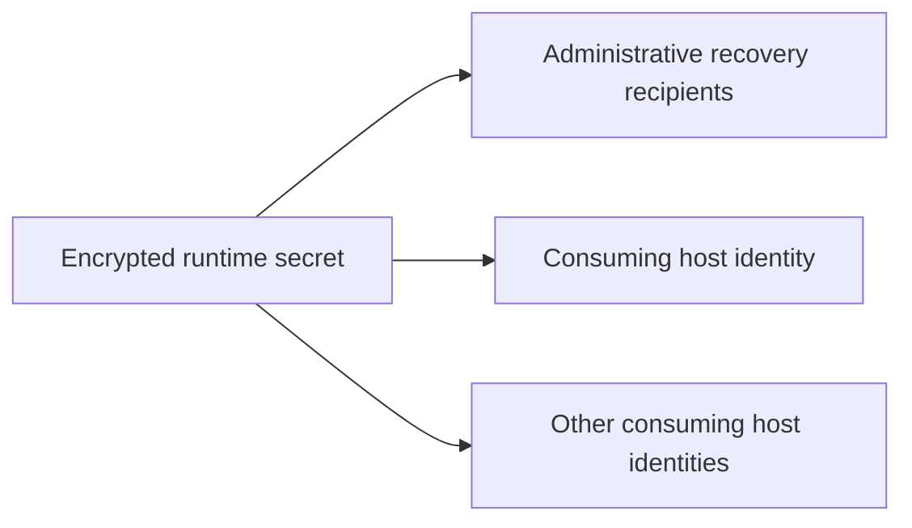

# Secrets and cryptographic identities

This repository keeps public identity metadata, encrypted payloads, and runtime
plaintext in separate layers. The design aims to make recovery possible without
allowing Nix evaluation to observe secret contents.

The fundamental boundary is:

```text
public metadata  ->  self.data     -> may be evaluated
encrypted files  ->  self.secrets  -> may enter the Nix store
plaintext        ->  runtime only  -> must never enter the flake source or store
```

Age encryption protects the payload even if the encrypted repository is copied.
Repository access control is useful defense in depth, but it does not replace
encryption.

## Identity roles

Keys are separated by operational role. Similar filenames or algorithms do not
make roles interchangeable.

| Role | Purpose | Private-material expectation |
|---|---|---|
| Administrative | Human recovery and administration through a hardware token or offline break-glass identity | Primary stubs may be deployable; exportable recovery keys remain offline. |
| SSH client | Authenticate a user or process originating from one device | An encrypted backup exists only when exact identity recovery is required. |
| System SSH host | Identify an installed host and decrypt that host's Agenix secrets | Stable machine state that must survive reinstall or be deliberately rotated. |
| Initrd SSH host | Identify pre-boot SSH used for remote unlock | Stable bootstrap state, always distinct from the system host key. |
| Deployment SSH | Authorize one installation session | Ephemeral; never a secret recipient or persistent identity. |

SSH host public keys are not login keys. They must never be added to
administrative or client `authorized_keys` sets.

Administrative authorization is consumed as a set. Routine consumers should use
the normalized administrative Age or SSH collections, rather than selecting one
primary identity, so the recovery path remains present. Selecting one identity
is appropriate only when the operation is inherently role-specific.

## Recipient graph

Ordinary runtime secrets are encrypted to:

1. every host that consumes the secret; and
2. the complete administrative Age recipient set.



Administrative recipients provide recovery; host recipients provide unattended
runtime decryption. A secret must not be encrypted only to its target host,
because loss of that host identity would also destroy the recovery path.

Private host-key backups are the bootstrap exception. Encrypting a private host
key to its matching public key is circular and useless after loss. Host-key
backups are encrypted to administrative recovery recipients, not to themselves.

Removing a recipient from newly encrypted files does not revoke access to old
ciphertext already possessed by that recipient. Respond to compromise by
rotating the affected identity and the underlying secrets, then re-encrypting
all affected payloads.

## Public-data boundary

`modules/data.nix` exposes public repository data through `self.data`. Identity
data is normalized by role, including:

- administrative Age recipients;
- administrative SSH login keys;
- per-device SSH client public keys; and
- SSH host public keys.

Consumers should use these named representations instead of reparsing files or
combining roles ad hoc. Public keys and fingerprints may enter the Nix store;
credentials and private material may not.

## Encrypted-data boundary

`modules/secrets.nix` exposes a deliberately narrow `self.secrets` interface. It
owns encrypted paths and public recipient metadata, not decryption:

```nix
self.secrets.path "service/example.age"
self.secrets.sshClient "example"
self.secrets.sshHost "example"
self.secrets.administrative.sshPrimary
self.secrets.recipients.administrators
self.secrets.recipients.hosts.example
```

Normalized descriptors expose `subpath`, `file`, and `exists`. SSH descriptors
also expose the normalized host and conventional filename; OpenPGP card-stub
descriptors expose the keygrip required for their runtime destination. Consumers
must use these descriptors rather than repeating paths, case normalization, or
keygrips.

`self.secrets` must not grow `read`, `readJSON`, or similar helpers. Evaluation
has no legitimate reason to inspect secret plaintext. Keeping the interface path
oriented also permits the encrypted tree to move behind another repository or
flake input without changing consumers.

Every `.nix` file under `modules/` is evaluated by `import-tree` as a flake-parts
module. Value-only Agenix rules and recipient tables therefore belong outside
that tree, normally with the encrypted repository policy.

## Naming and storage contract

Public identities live under `data/identities/`; encrypted private material
lives under `secrets/`. SSH names encode both role and normalized host name:

```text
data/identities/ssh-client/id_ed25519_<host>.pub
data/identities/ssh-host/ssh_host_ed25519_key_<host>.pub

secrets/ssh-client/id_ed25519_<host>.age
secrets/ssh-host/ssh_host_ed25519_key_<host>.age
```

The public client-key representation and encrypted OpenSSH basename need not be
identical, but consumers must follow the repository's normalized interfaces
rather than deriving paths independently. Initrd host identities add an
`_initrd` suffix and remain distinct from system host identities.

Encrypted files must be tracked before evaluating the Git-backed flake. An
untracked ciphertext file can exist in the working directory while remaining
absent from the flake source seen by Nix.

## Runtime deployment

`self.secrets` describes encrypted material. The NixOS feature that consumes a
secret owns its Agenix declaration, destination, owner, permissions, and service
dependency.

The module-class boundary remains strict:

- NixOS modules decrypt and deploy machine or user files through Agenix.
- Home Manager modules configure consumers and identity ordering, but do not
  assume responsibility for system-level decryption.
- Host-key backups are recovery artifacts, not target-side Agenix secrets.

The shared Agenix host-identity integration derives its default decryption
identity from `hostIdentity`. A host may deliberately override `age.identityPaths`,
but ordinary runtime secrets should use the stable system SSH host key, never an
initrd, client, or ephemeral deployment key.

Some deployment modules support an incomplete bootstrap repository: if their
optional ciphertext descriptor reports `exists = false`, they warn and omit the
corresponding `age.secrets` entry. Once ciphertext exists, decryption failure is
a hard activation error. It normally indicates an absent host identity, stale
recipient policy, or ciphertext that has not been rekeyed.

Administrative hardware-token stubs are convenience artifacts, not exportable
private-key backups. Deploying a stub still requires the corresponding token to
perform cryptographic operations.

## Stable host identities

System and initrd host identities are long-lived state. Reinstallation must
restore the existing key unless rotation is intentional. A safe provisioning
implementation must:

1. restore the encrypted backup when one exists;
2. refuse to generate a replacement when only the committed public key exists;
3. generate a key only when neither representation exists;
4. verify that restored private material derives the committed public key;
5. encrypt backups to all administrative recovery recipients;
6. stage plaintext with restrictive permissions; and
7. remove temporary plaintext on success and failure.

Rotation is a coordinated change: update the public identity, rekey affected
secrets, update SSH client host-key records, deploy the new private identity, and
verify access before retiring the old one.

Initrd keys require additional care. They are needed before the encrypted root
is unlocked and are ultimately embedded in boot-accessible material. Repository
encryption does not protect against an attacker who can replace an unauthenticated
initrd; authenticated boot is a separate threat-model requirement.

## Editing and reviewing secrets

The encrypted repository's Agenix rule catalogue is the authority for payload
recipients. Run Agenix from the directory against which those relative paths are
defined, for example:

```sh
cd secrets
nix run ..#agenix -- -e path/to/example.age -i /path/to/admin-identity
nix run ..#agenix -- -r -i /path/to/admin-identity
```

Before merging a secret change, verify:

- the consumer is concrete and owns the runtime destination;
- the rule includes every consuming host and every administrative recipient;
- no plaintext, decrypted diff, or private key was added to the source tree;
- public and encrypted names follow the role-specific convention;
- rekeying completed after recipient changes; and
- affected configurations still evaluate without exposing plaintext.

CryptID is the offline administrative and recovery workflow that produces some
of these identities. Its physical-media and lifecycle model is documented in
[`cryptid-protocol.md`](cryptid-protocol.md).
